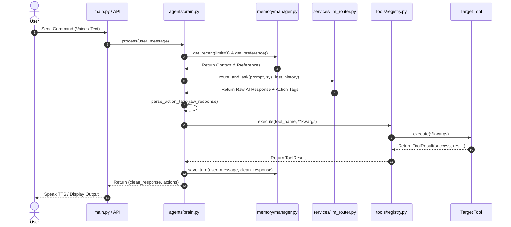

# 🏛️ J.A.R.V.I.S. AI OS — ARCHITECTURE & PLATFORM SPECIFICATION

> **Platform Mission**: *To build a maintainable, high-performance, resilient, plug-and-play AI Operating System Platform.*

---

## 1. 📐 Overall Architecture Diagram

```mermaid
graph TD
    User([👤 User / Client Interface]) --> API[🔌 API Layer: api/routes.py]
    API --> Brain[🧠 Agent Brain: agents/brain.py]
    
    %% Memory Subsystem
    Brain -->|1. Load Context| MemManager[💾 Memory Manager: memory/manager.py]
    MemManager -->|Fast O(1) Cache| MemCache[(⚡ In-Memory Cache)]
    MemManager -->|Persistence| MemStorage[storage.py / database.py]
    MemStorage -->|SQLite Queries| SQLite[(📦 SQLite DB: jarvis.db)]
    
    %% AI Decision Router Subsystem
    Brain -->|2. Query LLM| Router[🔀 Decision Engine: services/llm_router.py]
    Router -->|Casual <0.3s| Groq[⚡ Groq Service: services/groq.py]
    Router -->|Complex / Code| Gemini[🧠 Gemini Service: services/gemini.py]
    Router -->|Offline Mode| Ollama[💻 Ollama Service: services/ollama.py]
    Router -->|Telemetry| Metrics[📊 Metrics Tracker: services/metrics.py]
    
    %% Tool Subsystem
    Brain -->|3. Execute Intent| Registry[🛠️ Tool Registry: tools/registry.py]
    Registry -->|@register_tool| Calc[🧮 Calculator: tools/calculator.py]
    Registry -->|@register_tool| Music[🎵 Music: tools/music.py]
    Registry -->|@register_tool| Search[🔍 Search: tools/search.py]
    Registry -->|@register_tool| System[🖥️ System: tools/system.py]
    Registry -->|@register_tool| Browser[🌐 Browser: tools/browser.py]
```

---

## 2. 📁 Folder & Module Responsibilities

| Directory / File | Responsibility | Key Interfaces & Classes |
| :--- | :--- | :--- |
| **`agents/`** | Core reasoning, system instruction building, and action dispatching. | `JarvisBrain.think()`, `parse_action_tags()` |
| **`memory/`** | Decoupled persistent SQLite memory engine with singleton access and in-memory caching. | `MemoryManager`, `save_conversation()`, `save_preference()` |
| **`services/`** | Dedicated AI model integrations, intelligent routing, and provider health telemetry. | `LLMRouter`, `GroqService`, `GeminiService`, `OllamaService`, `MetricsTracker` |
| **`tools/`** | Plug-and-play Tool Registry framework where tools inherit from `BaseTool`. | `BaseTool`, `ToolResult`, `ToolRegistry`, `@register_tool` |
| **`api/`** | High-level API endpoint handlers connecting main application loops to Jarvis core. | `handle_user_request()`, `get_system_status()` |
| **`utils/`** | Cross-cutting utilities, UTF-8 terminal encoding, and phonetic speech sanitization. | `configure_encoding()`, `clean_speech_phonetics()` |

---

## 3. 🔄 Request Flow (`User ➔ Brain ➔ Router ➔ Tool ➔ Response`)



---

## 4. 🧠 Memory Subsystem Flow

```mermaid
graph LR
    A[User Prompt] --> B[MemoryManager Singleton]
    B --> C{Key in In-Memory Cache?}
    C -- Yes (Hit) --> D[Return Value in O(1) Speed]
    C -- No (Miss) --> E[Query SQLite Database: jarvis.db]
    E --> F[Populate In-Memory Cache]
    F --> D
```

---

## 5. 🎯 Future Platform Roadmap

```text
  v1.4.0 (Completed)  ➔ Central Tool Registry & BaseTool Framework
   ↓
  v1.4.1 (Active)     ➔ Testing Sprint (Unit Tests, Exception Resilience, CI/CD)
   ↓
  v1.5.0              ➔ Autonomous Planner Agent (Multi-Step Goal Decomposition)
   ↓
  v1.6.0              ➔ Vision Agent (Screen Capture, OCR & Multimodal Analysis)
   ↓
  v1.7.0              ➔ Document Understanding & Local RAG Knowledge Base
   ↓
  v2.0.0              ➔ Full Autonomous Multi-Agent AI Operating System
```
