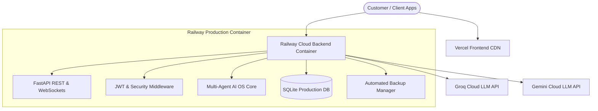

# 🌐 J.A.R.V.I.S. AI OS — Commercial SaaS Deployment Guide (v6.0.0)

## Overview
This guide documents the commercial production deployment of J.A.R.V.I.S. AI OS across **Railway Backend**, **Vercel Frontend**, **Docker Containers**, and **Automated Backups**.

---

## 🏛️ Production Deployment Topology



---

## 🚀 1. Railway Backend Deployment

- **Deployment Config**: [railway.json](file:///c:/Users/Aryan/Documents/jarvis/railway.json)
- **Production URL**: `https://jarvis-ai-production-eb13.up.railway.app`
- **Health Endpoint**: `GET https://jarvis-ai-production-eb13.up.railway.app/health`

### Environment Variables Matrix (Railway Settings)
```env
PORT=8000
ENVIRONMENT=production
GROQ_API_KEY=gsk_live_key...
GEMINI_API_KEY=AIzaSy...
SECRET_KEY=jarvis_production_secret_32bytes_min...
JARVIS_MASTER_ENCRYPTION_KEY=jarvis_production_aes256_master_key...
CORS_ORIGINS=https://jarvis-lyart-mu.vercel.app,http://localhost:3000
```

---

## 💻 2. Vercel Frontend Deployment

- **Deployment Config**: [vercel.json](file:///c:/Users/Aryan/Documents/jarvis/vercel.json)
- **Production URL**: `https://jarvis-lyart-mu.vercel.app`

---

## 🐳 3. Docker Container Deployment

Build and run using the multi-stage non-root [Dockerfile](file:///c:/Users/Aryan/Documents/jarvis/Dockerfile):

```bash
docker build -t jarvis-ai-os:v6.0.0 .
docker run -d -p 8000:8000 --name jarvis-app jarvis-ai-os:v6.0.0
```

---

## 🔄 4. Automated Backups & Disaster Recovery

Backups run automatically via `commercial.backups.backup_manager`.
- Manual Snapshot Trigger: `POST /api/v1/commercial/backups/create`
- Disaster Recovery Status: `GET /api/v1/commercial/disaster-recovery/status`
