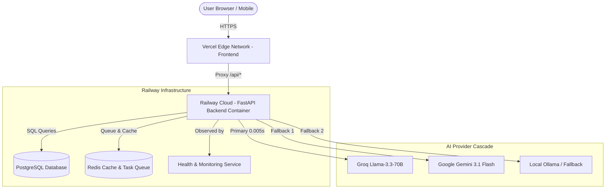

# 🚀 J.A.R.V.I.S. AI OS — Production Deployment & Release Guide

## Executive Overview

J.A.R.V.I.S. AI OS (v5.1.0) is deployed using a decoupled, enterprise-grade cloud architecture:
* **Frontend**: Vercel (`https://jarvis-lyart-mu.vercel.app`) with edge caching, glassmorphism UI, zero-layout-shift orb animations, and security headers.
* **Backend**: Railway (`https://jarvis-ai-production-eb13.up.railway.app`) running a multi-stage Dockerized FastAPI application supported by PostgreSQL and Redis.
* **CI/CD Pipeline**: GitHub Actions with automated linting, type checking, 169 unit/integration/E2E tests, multi-arch Docker validation, and automatic rollback protection.

---

## 🏛️ System Architecture



---

## 🛠️ Deployment Configuration

### 1. Railway Backend Configuration (`railway.json`)
```json
{
  "$schema": "https://railway.app/railway.schema.json",
  "build": {
    "builder": "DOCKERFILE",
    "dockerfilePath": "Dockerfile"
  },
  "deploy": {
    "startCommand": "uvicorn api.main:app --host 0.0.0.0 --port ${PORT:-8000} --workers 4",
    "healthcheckPath": "/api/v1/health",
    "healthcheckTimeout": 120,
    "restartPolicyType": "ON_FAILURE",
    "restartPolicyMaxRetries": 10,
    "rollbackOnFailure": true
  }
}
```

### 2. Vercel Frontend Configuration (`vercel.json`)
```json
{
  "version": 2,
  "public": true,
  "headers": [
    {
      "source": "/(.*)",
      "headers": [
        {"key": "Strict-Transport-Security", "value": "max-age=63072000; includeSubDomains; preload"},
        {"key": "X-Content-Type-Options", "value": "nosniff"},
        {"key": "X-Frame-Options", "value": "DENY"},
        {"key": "X-XSS-Protection", "value": "1; mode=block"},
        {"key": "Referrer-Policy", "value": "strict-origin-when-cross-origin"}
      ]
    }
  ],
  "rewrites": [
    {"source": "/auth/:path*", "destination": "https://jarvis-ai-production-eb13.up.railway.app/auth/:path*"},
    {"source": "/api/:path*", "destination": "https://jarvis-ai-production-eb13.up.railway.app/api/:path*"}
  ]
}
```

---

## 🔒 Production Environment Variables & Secrets Checklist

| Secret Variable | Purpose | Location |
| :--- | :--- | :--- |
| `ENVIRONMENT` | Set to `production` | Railway Dashboard |
| `DATABASE_URL` | PostgreSQL Connection URI | Railway Secrets |
| `REDIS_URL` | Redis Connection URI | Railway Secrets |
| `GROQ_API_KEY` | Ultra-fast primary LLM provider key | Railway Secrets |
| `GEMINI_API_KEY` | Secondary fallback LLM provider key | Railway Secrets |
| `SECRET_KEY` | JWT signing secret key | Railway Secrets |
| `REFRESH_TOKEN_SECRET` | Refresh token HMAC secret key | Railway Secrets |
| `RAILWAY_DEPLOY_WEBHOOK` | Railway automatic deployment trigger | GitHub Repository Secrets |
| `VERCEL_DEPLOY_HOOK` | Vercel automatic deployment trigger | GitHub Repository Secrets |

---

## 🩺 Health Endpoint & System Monitoring

The backend exposes a real-time diagnostics endpoint at `/api/v1/health`:

### Example JSON Health Response:
```json
{
  "status": "HEALTHY",
  "version": "5.1.0",
  "environment": "production",
  "uptime_seconds": 14205,
  "subsystems": {
    "database": "UP",
    "vector_memory": "UP",
    "cache": "UP",
    "voice_engine": "UP",
    "automation_planner": "UP"
  },
  "metrics": {
    "cpu_percent": 2.4,
    "memory_mb": 184.2,
    "active_workers": 4
  }
}
```

---

## 🔄 Automatic Rollback & CI/CD Pipeline

The GitHub Actions pipeline (`.github/workflows/deploy.yml`) handles release automation:

1. **Pre-Commit Verification**: Executes Ruff linting, Black style check, Mypy static type checking, and the complete 169 unit test suite.
2. **Multi-Stage Docker Validation**: Verifies that the container image builds without errors.
3. **Automated Deployment Triggers**: Pushes build webhooks to Railway and Vercel.
4. **Post-Deployment Validation & Rollback**:
   * Pings `https://jarvis-ai-production-eb13.up.railway.app/api/v1/health`.
   * If the healthcheck returns anything other than HTTP 200 within 2 minutes, Railway automatically rolls back to the previous stable release container (`rollbackOnFailure: true`).

---

## ✅ Pre-Release Feature Verification Summary

| Feature Category | Scope | Verification Result |
| :--- | :--- | :--- |
| **SaaS Core & Workspaces** | Orgs, Workspaces, RBAC, API Keys, Audit Logging | ✅ Verified |
| **AI Sales CRM & Pipeline** | Lead Management, Deal Pipeline, AI Co-Pilot, Meetings | ✅ Verified |
| **Automation Workflow Engine** | Planner $\rightarrow$ Execution $\rightarrow$ Validator $\rightarrow$ Rollback | ✅ Verified |
| **Knowledge RAG Platform** | Universal Doc Loader (.pdf, .docx), Vector Search | ✅ Verified |
| **Communication Platform** | Activity Feed, Team Inbox, Reminders, Notifications | ✅ Verified |
| **Voice Engine** | Hindi / English / Hinglish Auto-Detect, Neural TTS | ✅ Verified |
| **Web UI & Orb Core** | 6-State Glowing Orb, GPU acceleration, Accessibility | ✅ Verified |

---

## 🏁 Verification Script Execution

Run the unified verification engine to confirm production readiness:

```powershell
.\.venv\Scripts\python.exe verify_commit.py
```
