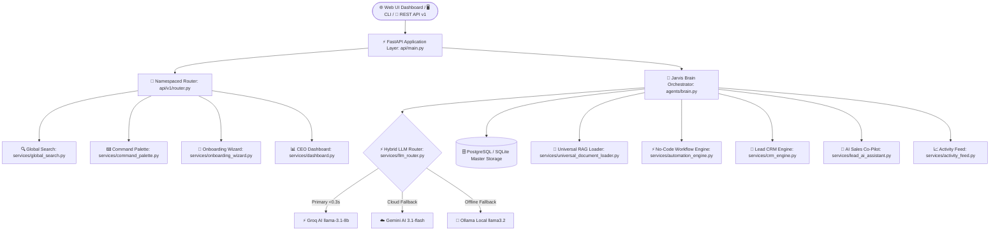

# 🤖 J.A.R.V.I.S. AI OS — Autonomous Business AI Operating System

[](https://github.com/sejalpatel9875-del/Jarvis-AI)
[](LICENSE)
[](https://python.org)
[](https://fastapi.tiangolo.com)
[](tests/)
[](#)

> **J.A.R.V.I.S. (Just A Rather Very Intelligent System)** is an autonomous, production-grade **Business AI Operating System**. Built for enterprise scalability, featuring **Multi-Tenant Workspaces**, **Universal RAG Document Intelligence**, **AI Sales CRM Co-Pilot**, **No-Code Automation Workflows**, **Role-Based Access Control (RBAC)**, **Global Search**, **Command Palette (Ctrl + K)**, and a **Commercial Glassmorphism Web App & Dashboard**.

---

## 🏛️ System Architecture



---

## ✨ Key Platform Modules & Capabilities

### 1. 🏢 Multi-Tenant Workspaces & RBAC Security
- **Isolated Workspaces**: Dedicated data isolation per department and organization (`core/workspaces.py`).
- **Role Matrix**: Granular permissions for `Owner`, `Admin`, `Manager`, `Employee`, and `Guest` (`core/rbac.py`).
- **Workspace API Keys**: Hashed API key authentication (`jarvis_sk_...`).

### 2. 🧠 Universal Vector RAG Intelligence
- Instant indexing for `.pdf`, `.docx`, `.pptx`, `.xlsx`, `.csv`, `.txt`, and `.md` files.
- Local TF-IDF Vector Embeddings with Cosine Similarity recall (`services/knowledge_engine.py`).
- Automated Executive Markdown Report Generation.

### 3. ⚡ No-Code Automation Workflow Platform
- Trigger-Condition-Action definitions (`DOCUMENT_UPLOADED`, `SCHEDULED_CRON`, `TASK_FINISHED`).
- Background recurring cron execution scheduler (`services/workflow_scheduler.py`).
- Workflow execution logging with exponential retry backoff loops (`services/workflow_execution.py`).

### 4. 💼 Lead CRM & AI Sales Co-Pilot
- Inbound lead tracking (`NEW`, `QUALIFIED`, `PROPOSAL`, `WON`, `LOST`) with AI Intent Scoring (0-100).
- Revenue Deal Pipeline metrics (`total_pipeline_value_usd`, `avg_deal_size_usd`).
- 1-Click personalized email outreach drafting and meeting transcript summaries (`services/lead_ai_assistant.py`).

### 5. 💬 Team Communication & Activity Feed
- GitHub-style real-time chronological workspace activity feed (`services/activity_feed.py`).
- Departmental Team Inbox (`#SALES`, `#ENGINEERING`, `#HR`, `#MARKETING`).
- Task calendar reminders and completion status engine.

### 6. 🎨 Commercial Glassmorphic Web App & Command Palette
- **Web App & Landing Page**: Modern SaaS landing page (`web/index.html`).
- **Command Palette (`Ctrl + K`)**: Keyboard-driven quick action shortcuts.
- **Global Search**: Unified indexing across Leads, Deals, Workflows, Knowledge, and Activity.

---

## 📁 Directory Structure

```text
jarvis/
├── api/                        # FastAPI Web Layer
│   ├── auth.py                 # Security & X-API-Key Middleware
│   ├── main.py                 # FastAPI Server Entrypoint
│   └── v1/router.py            # Versioned REST Endpoint Router
├── core/                       # Foundation Utilities & Enums
│   ├── constants.py            # Global App Version (v4.7.0)
│   ├── rbac.py                 # Role-Based Access Control Engine
│   └── workspaces.py           # Multi-Tenant Workspace Manager
├── docs/                       # Commercial Launch & API Documentation
│   └── COMMERCIAL_LAUNCH_GUIDE.md # Commercial Pricing & API Specs
├── memory/                     # Persistent Database Layer
│   ├── database.py             # PostgreSQL / SQLite Master Connection Pool
│   └── workspace_memory.py     # Workspace Isolated Fact Memory
├── services/                   # Business Services Layer
│   ├── activity_feed.py        # Workspace Event Feed Tracker
│   ├── automation_engine.py    # Trigger-Action Workflow Engine
│   ├── command_palette.py      # Quick Shortcuts Registry
│   ├── crm_engine.py           # Sales Lead CRM Engine
│   ├── dashboard.py            # CEO Executive Command Center
│   ├── deal_pipeline.py        # Revenue Deal Pipeline Metrics
│   ├── global_search.py        # Cross-Entity Global Search Engine
│   ├── knowledge_engine.py     # Workspace RAG Engine
│   ├── lead_ai_assistant.py    # AI Sales Co-Pilot Engine
│   ├── onboarding_wizard.py    # Guided 4-Step Onboarding Tracker
│   ├── redis_cache.py          # O(1) Redis Query Caching
│   ├── team_inbox.py           # Departmental Team Messaging
│   └── universal_document_loader.py # PDF/DOCX/XLSX Universal Loader
├── web/                        # Commercial SaaS Landing Page
│   ├── index.html              # Glassmorphic HTML Web Interface
│   ├── styles.css              # Dark Glassmorphism CSS Design Tokens
│   └── app.js                  # Interactive Demo Logic
├── tests/                      # Automated Test Suite (145+ Tests)
├── Dockerfile                  # Production Container Configuration
├── docker-compose.yml          # Multi-Container Compose Configuration
└── README.md                   # System Documentation
```

---

## 🚀 Quick Start Guide

### 1. Installation
```bash
# Clone the repository
git clone https://github.com/sejalpatel9875-del/Jarvis-AI.git
cd Jarvis-AI

# Create virtual environment
python -m venv .venv
.venv\Scripts\activate      # Windows
source .venv/bin/activate   # Linux/macOS

# Install dependencies
pip install -r requirements.txt
```

### 2. Environment Setup
Copy `.env.example` to `.env`:
```env
ENVIRONMENT=production
DATABASE_URL=sqlite:///./memory/jarvis.db
GROQ_API_KEY=your_groq_api_key
GEMINI_API_KEY=your_gemini_api_key
```

### 3. Running the Server
```bash
uvicorn api.main:app --reload --host 127.0.0.1 --port 8000
```
- Web Application Landing Page: **`http://127.0.0.1:8000/`**
- Interactive Swagger API Docs: **`http://127.0.0.1:8000/docs`**

---

## 🧪 Running Automated Unit Tests

```bash
.venv\Scripts\python.exe -m unittest discover tests
```
```text
Ran 145 tests in 0.247s

OK
```

---

## 📜 License
Distributed under the MIT License. See `LICENSE` for details.
