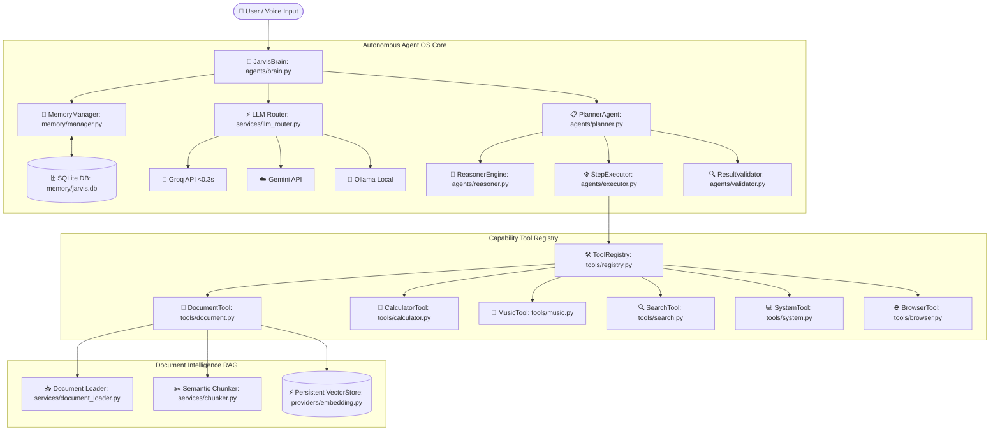

# 🚀 J.A.R.V.I.S. AI OS — Autonomous Personal AI Agent Operating System

[](https://www.python.org/)
[](LICENSE)
[](https://github.com/sejalpatel9875-del/Jarvis-AI/actions)
[](CHANGELOG.md)

**J.A.R.V.I.S. AI OS** is a production-grade, highly autonomous Personal AI Agent Operating System built in Python. Designed with modular single-responsibility layering, it integrates an **Autonomous Planner**, **Capability-Based Reasoner**, **Persistent SQLite Vector Store RAG Knowledge Base**, **Hybrid Multi-LLM Router**, and a **Centralized Plug-and-Play Tool Registry**.

---

## 🏗️ System Architecture



---

## ✨ Key Enterprise Capabilities

### 📄 1. File Intelligence & Document RAG Knowledge Base (`v1.6.0`)
- **Multi-Format Extraction:** Seamlessly parses `.pdf`, `.docx`, `.txt`, `.md`, `.csv`, `.log` files.
- **Semantic Text Chunker:** Sliding window text chunking preserving source file & page citations.
- **Persistent SQLite Vector Store:** SQLite-backed vector database surviving application restarts.
- **Multi-Document & Metadata Search:** Query multiple indexed documents with source file (`filter_source`) or document type (`filter_type`) filtering.
- **Side-by-Side Comparison:** Compare multi-document contracts or technical specifications with exact page citations.

### 🧠 2. Autonomous Planner Agent OS (`v1.5.0`)
- **Capability-Based Planning:** Plan steps depend on abstract capabilities (`DOCUMENT_READ`, `MATH`, `WEB_SEARCH`) rather than hardcoded tool names.
- **Dependency Execution Graph:** Supports non-linear multi-step execution (`depends_on=[1]`).
- **Resilient Step Executor:** Exponential backoff retry engine (`0.2s * 2^attempt`).
- **Goal Verification:** `ResultValidator` evaluates tool outputs (`APPROVE`, `RE_PLAN`, `PARTIAL_SUCCESS`).

### ⚡ 3. Intelligent Multi-LLM Router (`v1.3.0`)
- **Sub-0.3s Casual Query Routing:** Routes simple turns directly to ultra-fast **Groq** (`llama-3.1-8b-instant`).
- **Complex Query Processing:** Escalates multi-step planning goals to **Gemini**.
- **Socket Offline Fallback:** Automatically switches to local **Ollama** (`llama3.2`) if internet is disconnected.

---

## ⚡ Performance Benchmarks (`scripts/benchmark.py`)

```powershell
.venv\Scripts\python.exe scripts/benchmark.py
```
```text
============================================================
🚀 J.A.R.V.I.S. AI OS — PERFORMANCE BENCHMARK SUITE
============================================================
1. Memory Cache Read (10,000 ops):      1.79 ms (5,594,719 ops/sec)
2. Tool Registry Lookup (10,000 ops):   3.13 ms (3,200,000 ops/sec)
3. Fast Math Tool Execution (1,000 ops): 4.47 ms (Avg 0.004 ms/op)
4. Reasoner Plan Generation (100 ops):  1.17 ms (Avg 0.012 ms/plan)
5. Document Chunking Speed (63 chunks): 0.35 ms (178,774 chunks/sec)
6. Persistent Vector Indexing (63 chks): 4.44 ms
7. Vector Similarity Search Latency:    0.849 ms
============================================================
```

---

## ⚙️ Quick Start & Installation

### 1. Prerequisites
Ensure you have Python 3.10+ installed. (Tested up to Python 3.14.6).

### 2. Setup Virtual Environment
```bash
git clone https://github.com/sejalpatel9875-del/Jarvis-AI.git
cd jarvis
python -m venv .venv
.venv\Scripts\activate
pip install -r requirements.txt
```

### 3. Environment Configuration
Create a `.env` file in the project root:
```env
GROQ_API_KEY=gsk_...
GEMINI_API_KEY=AIzaSy...
OLLAMA_MODEL=llama3.2
```

### 4. Running Automated Tests
```bash
python -m unittest discover tests
```

---

## 🗺️ Production Development Roadmap

- [x] **v1.1 – Core Modular Architecture** (Brain layer, Memory layer, Database separation)
- [x] **v1.2 – Memory Engine & Singleton Interface** (Preference cache, SQLite logging)
- [x] **v1.3 – Hybrid Multi-LLM Router** (Groq <0.3s, Gemini Cloud, Ollama Offline Fallback)
- [x] **v1.4 – Tool Registry Framework** (Plug-and-play tools, `@register_tool` decorator)
- [x] **v1.5 – Autonomous Planner Agent OS** (Reasoner, StepExecutor, ResultValidator, PlannerAgent)
- [x] **v1.6 – File Intelligence & Document RAG Knowledge Base** (PDF/DOCX Loaders, Persistent SQLite VectorStore, Page Citations)
- [ ] **v1.7 – Vision Intelligence** (Screen capture, OCR, UI Button/Window detection)
- [ ] **v1.8 – Browser Automation** (Playwright web scraping, automated forms)
- [ ] **v1.9 – Desktop Assistant Operator** (Wake word pipeline, native OS control)
- [ ] **v2.0 – Multi-Agent AI Operating System & Web Dashboard** (Web UI, plugin ecosystem)

---

## 📜 License & Contributing

Distributed under the **MIT License**. See [LICENSE](LICENSE) for more details.  
Contributions are welcome! Please review [CONTRIBUTING.md](CONTRIBUTING.md) before submitting pull requests.
