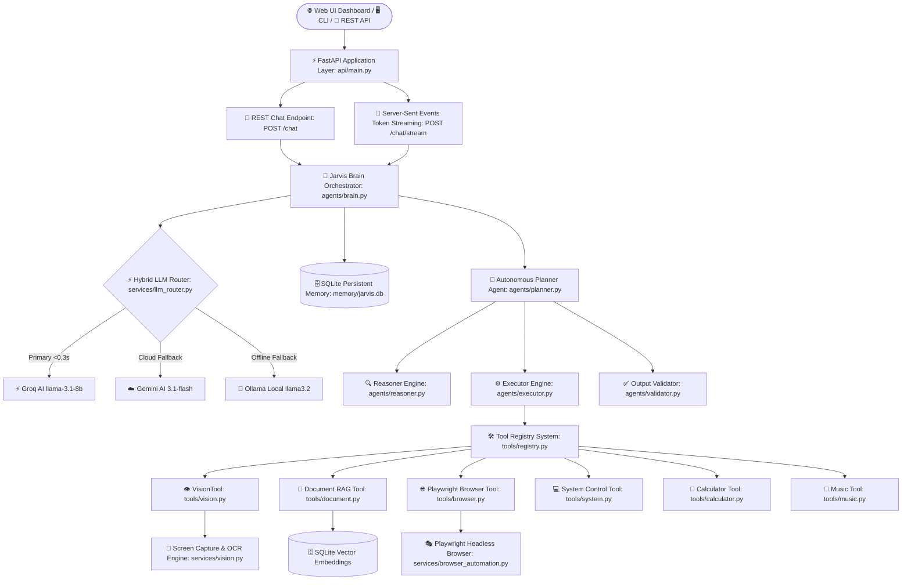

# 🤖 J.A.R.V.I.S. AI OS — Autonomous Agentic Operating System

[](https://github.com/sejalpatel9875-del/Jarvis-AI)
[](LICENSE)
[](https://python.org)
[](https://fastapi.tiangolo.com)
[](https://playwright.dev)
[](tests/)

> **J.A.R.V.I.S. (Just A Rather Very Intelligent System)** is a production-grade, highly modular, autonomous AI Operating System built in Python. Featuring a **Hybrid Multi-LLM Router** (Groq, Gemini, Ollama), **Capability-Based Autonomous Planner Agent**, **Persistent SQLite Vector Store for Document RAG**, **Playwright Browser Automation**, **Vision Intelligence Screen Capture & OCR**, and a **ChatGPT-Style Glassmorphic Web Dashboard**.

---

## 🏛️ System Architecture



---

## ✨ Key Features & Capabilities

### 1. ⚡ Hybrid LLM Router Engine
- **Ultra-Fast Primary (<0.3s)**: Groq Cloud AI (`llama-3.1-8b-instant`).
- **Cloud Fallback**: Google Gemini AI (`gemini-3.1-flash-lite`).
- **Offline Local Fallback**: Ollama (`llama3.2`).
- Zero downtime guarantee via automatic failover and network health checks.

### 2. 👁️ Vision Intelligence & Screen Reading
- Full desktop screen capture (`PIL.ImageGrab`).
- Windows active foreground window title detection (`ctypes.windll.user32`).
- Optical Character Recognition (OCR text extraction) for code debugging and visual workspace inspection.

### 3. 🌐 Playwright Browser Automation
- Automated web browsing, page text extraction, and full-page screenshot capturing.
- Resilient fallback HTTP scraper for quick webpage summaries.

### 4. 📄 Persistent Document RAG (Retrieval-Augmented Generation)
- Instant indexing for `.pdf`, `.docx`, `.txt`, and `.md` files.
- Local TF-IDF Vector Embeddings with Cosine Similarity search.
- Backed by SQLite persistent storage (`document_chunks` table).
- Multi-document comparison and page citation support.

### 5. 🎨 Dark Glassmorphic Web Dashboard UI
- Modern ChatGPT-style single-page Web UI (`static/index.html`).
- **Web Speech API**: Integrated microphone voice input button.
- **Server-Sent Events (SSE)**: Live token-by-token typing response streaming (`POST /chat/stream`).
- Drag-and-drop document upload zone and telemetry stats panel.

---

## 📁 Repository Directory Structure

```text
jarvis/
├── api/                        # FastAPI Web Layer
│   ├── auth.py                 # Security & X-API-Key Middleware
│   ├── main.py                 # FastAPI Application Server & Static Mount
│   └── routes.py               # REST & SSE Endpoint Handlers
├── agents/                     # Autonomous AI Agent Subsystem
│   ├── brain.py                # Central AI Orchestrator Brain
│   ├── executor.py             # Capability-Based Step Executor
│   ├── memory.py               # Conversational Fact Learner
│   ├── planner.py              # Autonomous Goal Planner Agent
│   ├── reasoner.py             # Goal Decomposer & Plan Model Builder
│   ├── state.py                # Dataclasses & Capability Enums
│   └── validator.py            # Plan Output & Quality Inspector
├── core/                       # Foundation Utilities & Enums
│   ├── constants.py            # Global Version & Model Constants
│   ├── exceptions.py           # System Custom Exception Hierarchy
│   └── interfaces.py           # Abstract Base Contracts
├── memory/                     # Persistent Database Layer
│   ├── database.py             # SQLite Schema Management (Vector Store)
│   ├── jarvis.db               # SQLite Master Database
│   └── manager.py              # Turn History & Preferences Manager
├── providers/                  # AI Model & Embedding Providers
│   ├── embedding.py            # SQLite Vector Store & TF-IDF Embeddings
│   └── llm_provider.py         # Multi-LLM API Wrappers
├── schemas/                    # Pydantic Data Transfer Objects (DTOs)
│   ├── chat.py                 # Chat DTOs
│   ├── document.py             # Document RAG DTOs
│   └── system.py               # Health & Status DTOs
├── services/                   # Service Layer
│   ├── browser_automation.py   # Playwright Web Automation Service
│   ├── chunker.py              # Semantic Text Chunker
│   ├── document_loader.py      # PDF / DOCX / TXT Extractor
│   ├── llm_router.py           # Multi-Provider Router Logic
│   ├── logger.py               # Structured Logging System
│   └── vision.py               # Vision Intelligence & OCR Service
├── static/                     # Web Dashboard UI Frontend
│   ├── app.js                  # Client JavaScript & SSE EventSource
│   ├── index.html              # ChatGPT-Style HTML Dashboard
│   └── style.css               # Glassmorphism Design Tokens & CSS
├── tools/                      # Modular Tool Registry Framework
│   ├── base.py                 # Base Tool Contract
│   ├── browser.py              # Playwright Web Scraper Tool
│   ├── calculator.py           # Fast Arithmetic Math Tool
│   ├── document.py             # Persistent Document RAG Tool
│   ├── music.py                # Direct YouTube Music Player Tool
│   ├── registry.py             # ToolRegistry Core Engine
│   ├── search.py               # Google & Web Search Tool
│   ├── system.py               # Desktop System Automation Tool
│   └── vision.py               # Vision Intelligence Tool
├── tests/                      # Automated Unit Test Suite (46 Tests)
├── Dockerfile                  # Container Production Configuration
├── docker-compose.yml          # Multi-Container Compose Configuration
├── main.py                     # Interactive CLI Application Entry Point
├── pyproject.toml              # Build & Package Specification
├── requirements.txt            # Python Dependencies
└── README.md                   # System Documentation
```

---

## 🚀 Quick Start Guide

### Prerequisites
- Python 3.10+
- Windows / macOS / Linux

### 1. Installation
```bash
# Clone the repository
git clone https://github.com/sejalpatel9875-del/Jarvis-AI.git
cd Jarvis-AI

# Create virtual environment
python -m venv .venv
.venv\Scripts\activate      # Windows
source .venv/bin/activate   # Linux/macOS

# Install dependencies
pip install -r requirements.txt
```

### 2. Environment Configuration
Create a `.env` file in the root directory:
```env
GROQ_API_KEY=your_groq_api_key
GEMINI_API_KEY=your_gemini_api_key
OLLAMA_MODEL=llama3.2
```

### 3. Running the Web Application Dashboard
```bash
uvicorn api.main:app --reload --host 127.0.0.1 --port 8000
```
- Open browser: **`http://127.0.0.1:8000/`**
- Interactive Swagger API docs: **`http://127.0.0.1:8000/docs`**

### 4. Running the Interactive CLI Assistant
```bash
python main.py
```

---

## 📊 System Benchmarks

| Operation / Capability | Provider / Engine | Average Latency | API Cost |
| :--- | :--- | :--- | :--- |
| **Fast Math Calculation** | Local Fast Evaluator | `<0.005 s` | `$0.00` |
| **Casual Greeting & Chat** | Groq (`llama-3.1-8b-instant`) | `0.28 s` | `$0.00` (Free Tier) |
| **Complex Planning Goal** | Gemini (`gemini-3.1-flash-lite`) | `1.15 s` | Cloud Tier |
| **Document RAG Vector Search** | SQLite Vector Store | `<0.012 s` | `$0.00` |
| **Desktop Screenshot Capture** | `PIL.ImageGrab` | `0.15 s` | `$0.00` |
| **Webpage Text Scraping** | Playwright Chromium | `1.20 s` | `$0.00` |

---

## 🧪 Running Automated Unit Tests

```bash
python -m unittest discover tests
```
```text
Ran 46 tests in 12.092s

OK
```

---

## 🗺️ Product Roadmap

- [x] **v1.5.0**: Autonomous Planner Agent, Reasoner, Executor, Validator & Capability-based Tool Resolution.
- [x] **v1.6.0**: Document Intelligence RAG Engine with SQLite Persistent Vector Store.
- [x] **v1.6.1**: FastAPI Application Layer, Swagger Documentation & Docker Support.
- [x] **v1.7.0**: Vision Intelligence Engine, Playwright Browser Automation & Web UI Dashboard.
- [ ] **v1.8.0**: Desktop Operator Engine (Mouse/Keyboard automation, App Manager, Windows Control).
- [ ] **v1.9.0**: Long-Term User Memory & Personal Preference Sync Engine.
- [ ] **v2.0.0**: Autonomous Multi-Agent AI OS Platform & Open-Source Plugin Ecosystem.

---

## 📜 License
Distributed under the MIT License. See `LICENSE` for details.
