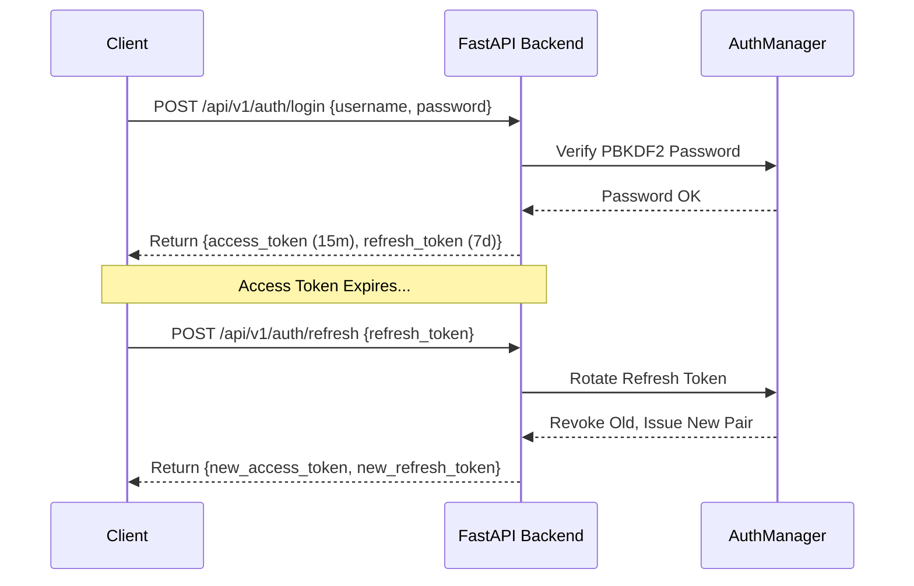

# 🛡️ J.A.R.V.I.S. AI OS — Enterprise Security Documentation (v5.7.0)

## Overview
J.A.R.V.I.S. AI OS implements zero-trust **Enterprise Security (v5.7.0)**. Every endpoint requires authentication by default unless explicitly listed on the Public Allowlist. Data is encrypted in transit and at rest using AES-256 standards.

---

## 🔒 1. Authentication & Token Lifecycle (`security/auth_manager.py`)

- **JWT Access Tokens**: Short-lived (15 minutes expiry) signed using HMAC-SHA256.
- **Refresh Tokens**: Long-lived (7 days expiry) stored in a secure token rotation vault.
- **Token Rotation**: Exercising a refresh token automatically revokes the old token and issues a brand-new access/refresh token pair, preventing replay attacks.
- **Password Hashing**: PBKDF2 with HMAC-SHA256 (100,000 iterations + unique per-user salt).

---

## 🔑 2. Secrets Manager Vault (`security/secrets_manager.py`)

- **AES-256 Symmetric Encryption**: All API keys and environment secrets are encrypted using AES-256 stream transformations.
- **Zero-Exposure Policy**: Secrets are decrypted strictly in-memory during external API requests and are stripped from all frontend JSON outputs and log files.

---

## 🌐 3. Security Headers & CSP (`security/middleware.py`)

All HTTP responses automatically include enterprise security headers:

| Header Name | Value | Protection Capability |
| :--- | :--- | :--- |
| `Content-Security-Policy` | `default-src 'self'; script-src 'self' 'unsafe-inline';` | Prevents unauthorized script execution. |
| `X-Frame-Options` | `DENY` | Prevents Clickjacking attacks in iFrames. |
| `X-Content-Type-Options` | `nosniff` | Blocks MIME-type sniffing exploits. |
| `Referrer-Policy` | `strict-origin-when-cross-origin` | Protects sensitive URL referrers. |
| `Strict-Transport-Security` | `max-age=31536000; includeSubDomains` | Enforces HTTPS HSTS connections. |
| `X-XSS-Protection` | `1; mode=block` | Enables browser XSS filters. |

---

## 🚦 4. Rate Limiting & Input Sanitization

- **Rate Limiting**: Sliding-window rate limiter restricting IP addresses to a maximum of **100 requests per minute** (`429 Too Many Requests`).
- **XSS & SQL Injection Safeguards**: Input payloads are stripped of `<script>` tags and malicious SQL comment markers (`--`, `/*`, `*/`, `;`).

---

## 🛡️ 5. Public Endpoint Allowlist

All endpoints require `Bearer <JWT>` or `API Key` (`jarvis_sk_...`) except:
1. `GET /health`
2. `POST /api/v1/auth/login`
3. `POST /api/v1/auth/refresh`
4. `POST /api/v1/auth/register`
5. `GET /docs` & `GET /openapi.json`
