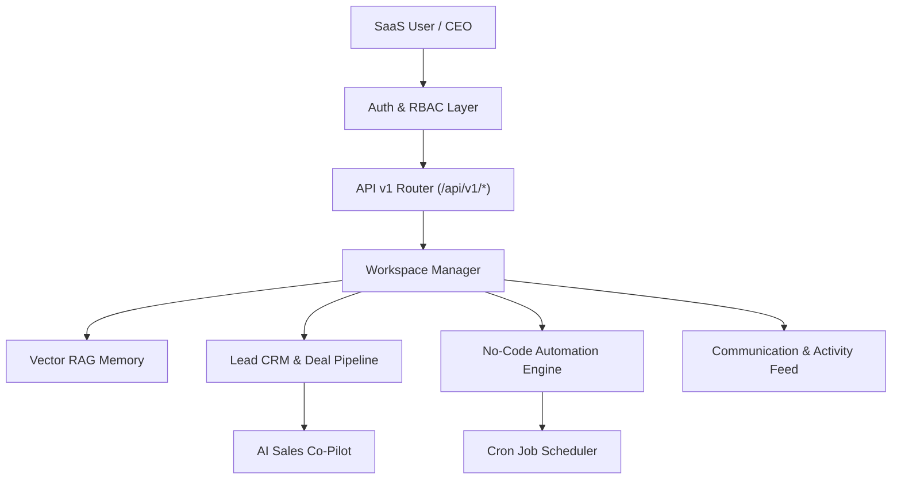

# 🚀 J.A.R.V.I.S. AI OS Commercial Launch Guide

---

## 🏆 Product Overview
**J.A.R.V.I.S. AI OS (v4.7.0)** is an **Autonomous Business AI Operating System** designed for enterprise organizations and fast-growing teams. It combines multi-tenant isolation, workspace memory vector RAG, sales CRM lead pipelines, trigger-action no-code automations, and live activity feed streams into a single cohesive platform.

---

## 🏗️ System Architecture

---

## 💎 SaaS Commercial Pricing Tiers

| Feature Tier | Free Tier | Pro Tier ($49/mo) | Business/Enterprise ($199/mo) |
| :--- | :--- | :--- | :--- |
| **AI Requests / Day** | 100 | 1,000 | Unlimited (10,000+) |
| **Workspaces** | 1 Workspace | 5 Workspaces | Unlimited |
| **Vector RAG Memory** | Basic | Advanced Cosine | Hybrid Vector RAG |
| **Automation Workflows**| 2 Pipelines | 20 Pipelines | Unlimited |
| **CRM Leads & Deals** | 50 Leads | 1,000 Leads | Unlimited |
| **Support** | Community | Priority Email | Dedicated Account Manager |

---

## 🔌 Core API Endpoints Reference

### 1. Global Enterprise Search
- **Endpoint**: `GET /api/v1/search`
- **Params**: `workspace_id`, `query`
- **Response**: Combined matches across Leads, Deals, Workflows, and Activity Feed.

### 2. Command Palette Actions
- **Endpoint**: `GET /api/v1/command-palette`
- **Params**: `role`
- **Response**: List of quick actions and keyboard shortcuts (`Ctrl+K`, `Ctrl+Shift+L`).

### 3. CEO Dashboard Metrics
- **Endpoint**: `GET /api/v1/ceo-dashboard`
- **Response**: Consolidated business revenue, lead counts, active workflows, and system health status.
